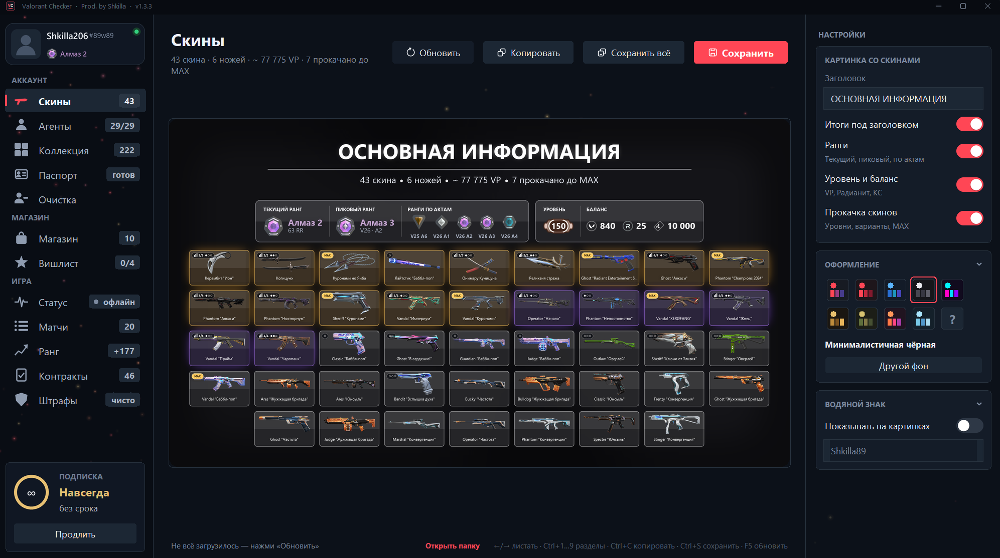
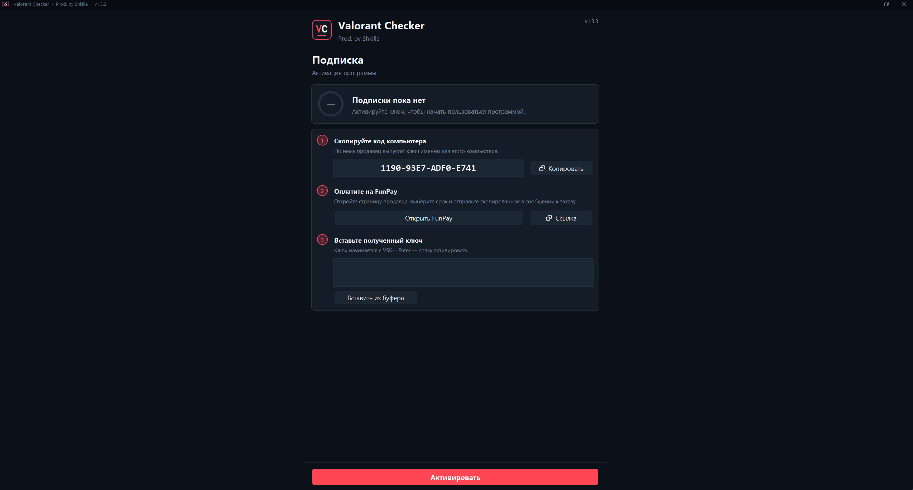
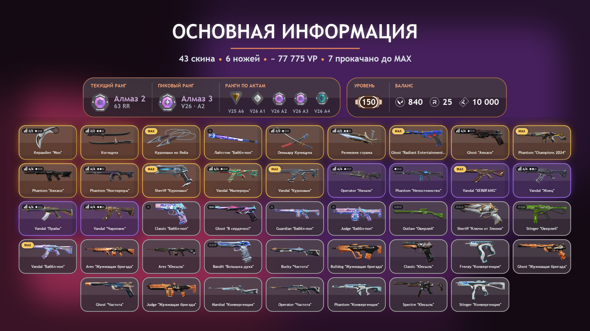
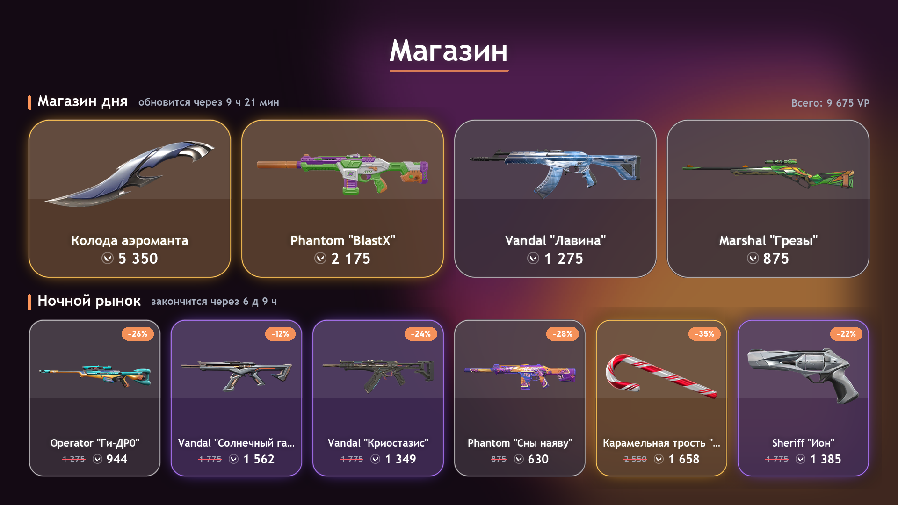
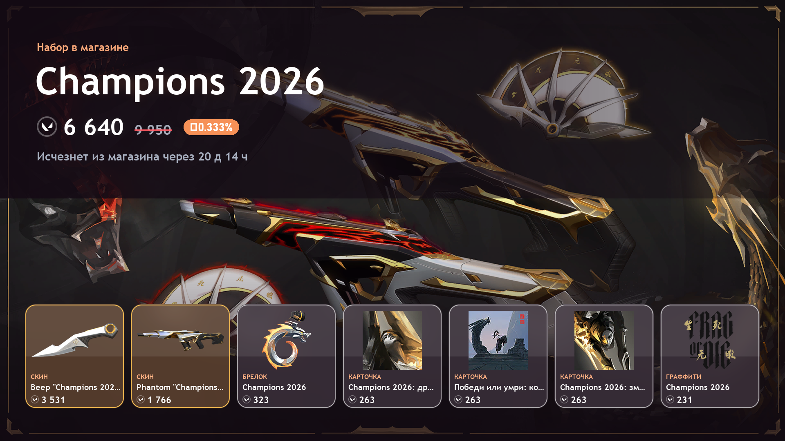
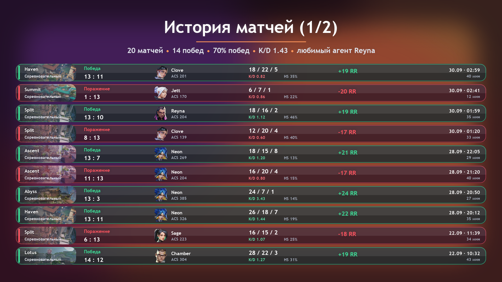
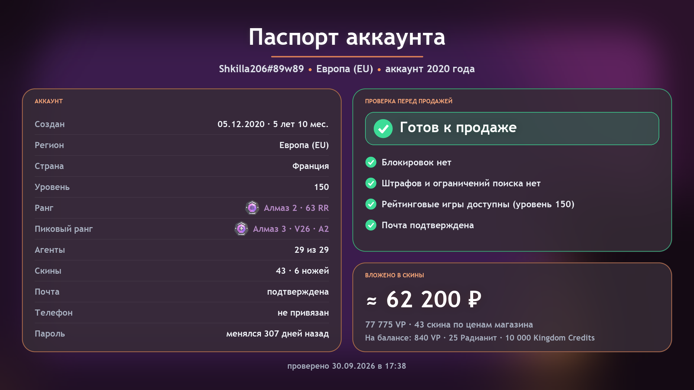
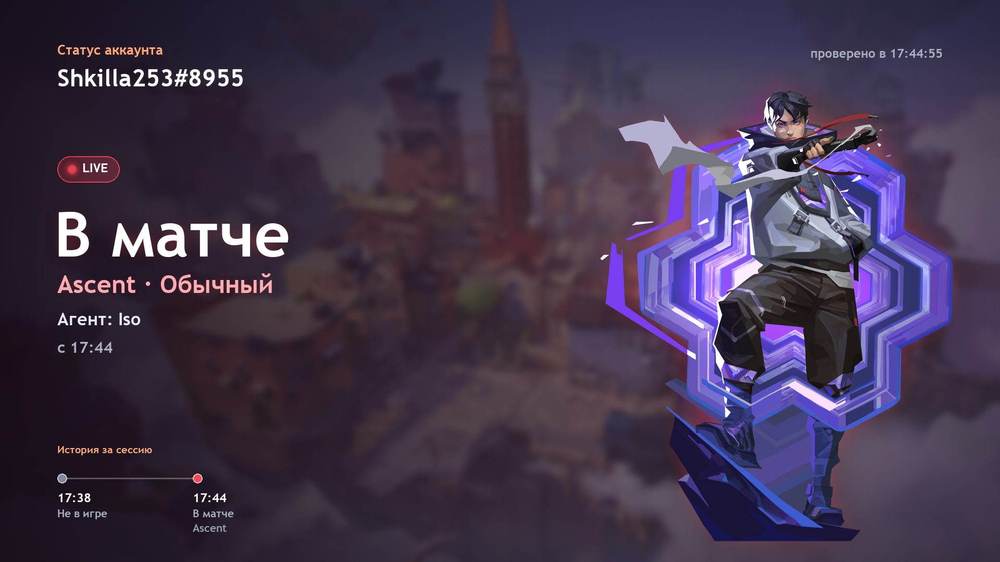
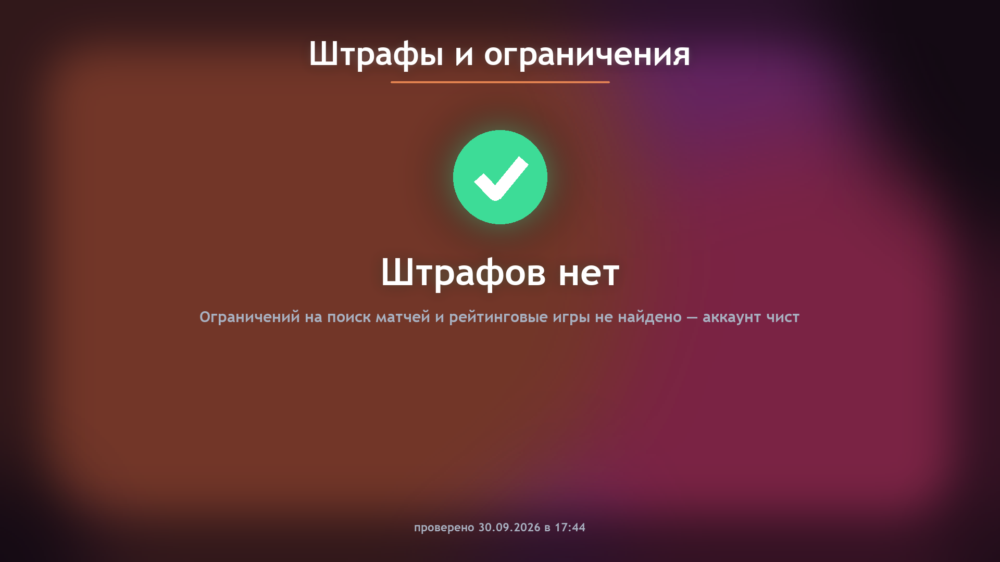
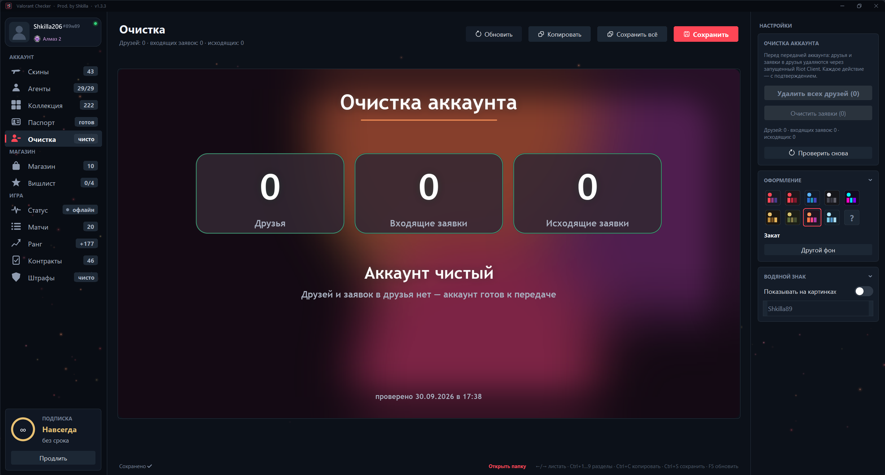

# 🎮 Valorant Checker

**Все данные твоего аккаунта Valorant в красивых картинках — без запуска игры**

Скины, агенты, ранг, матчи, магазин и даже обслуживание аккаунта — всё в одной программе. **Вход в саму игру не требуется** — просто открой Riot Client, запусти Valorant Checker и выбери раздел. Готовые картинки сохраняются в папку рядом с программой.

> 💡 **Важно для тех, кто сдал аккаунт в аренду:** ты можешь проверить, в матче ли сейчас клиент, находится ли он в меню или вообще вышел из игры — всё это видно в разделе **«Статус»** без необходимости запускать саму игру.

<div align="center">

[**📥 Скачать Valorant Checker** (Windows 10/11)](#-начало-работы--1-минута) ‎ | ‎ [**💳 Где купить подписку**](#-где-купить-подписку) ‎ | ‎ [**❓ Вопросы**](#-часто-задаваемые-вопросы)


</div>

---

## 🚀 Начало работы — 1 минута

### 1️⃣ Скачай файл
Нажми эту кнопку — скачается один файл размером ~50 МБ:

<div align="center">

[](https://github.com/blizzardtv218-cloud/ValorantChecker/releases/latest/download/ValorantChecker.exe)

*(это обычная кнопка скачивания, не вирус — программа проверяется репутацией продавца)*

</div>

Подробнее см. раздел [🔒 Безопасность](#-безопасность-твоего-аккаунта).

### 2️⃣ Положи файл в удобное место
Папка на рабочем столе, в Документах, в Program Files — не важно. В эту же папку программа будет сохранять готовые картинки.

```
📁 Valorant Checker/
  └─ ValorantChecker.exe
  └─ 📸 картинки с скинами
  └─ 📸 картинки с матчами
  └─ ...
```

### 3️⃣ Запусти программу
Дважды щёлкни по файлу. Первый запуск:
- Показан экран **«Активация подписки»** с кодом компьютера (вида `XXXX-XXXX-XXXX-XXXX`)
- Нажми **«Копировать»** → отправь код продавцу
- Получишь ключ (начинается с `VSK-`) → вставь его в программу и нажми **«Активировать»**

Всё! На второй запуск программа загрузит данные аккаунта автоматически.

> **Windows пишет «Система защитила ваш компьютер»?**  
> Это происходит со всеми программами без платного сертификата от Microsoft (стоит тысячи долларов). Это нормально.  
> Нажми **«Подробнее»** → **«Выполнить в любом случае»**.  
> Если антивирус удалил файл — добавь исключение и скачай заново.

---

## 📚 Что умеет программа

### 📸 **Все разделы создают красивые картинки (PNG)**

| Раздел | Что видишь |
|--------|-----------|
| **🎭 Паспорт** | Карточка профиля: ник, ранг, уровень, баланс VP/Rad, лучшие агенты |
| **🔪 Скины** | Вся коллекция скинов с **уровнем прокачки** и иконкой MAX (если скин максирован) |
| **🕵️ Агенты** | Все купленные агенты с их дизайном |
| **💎 Коллекция** | Брелки, игровые карточки, граффити и титулы в отдельных картинках |
| **🏪 Магазин** | **Магазин дня** — как сейчас на сервере (ежедневное обновление в 00:00 МСК) |
| **🌙 Ночной рынок** | Твой личный Ночной рынок с 8 скинами со скидкой (в отдельной картинке) |
| **⭐ Вишлист** | Отслеживание избранных скинов: видишь, когда скин появился в магазине |
| **📊 Матчи** | История последних 20 матчей: результат, агент, режим, К/D/A, время |
| **📈 Ранг** | График твоего ранга со временем (как поднимался и падал) |
| **📝 Контракты** | Уровень всех контрактов на агентов (сколько осталось до следующего уровня) |
| **⚠️ Штрафы** | Информация о штрафах (если они есть) |
| **🧹 Очистка аккаунта** | Удаление **всех друзей сразу** с обязательным подтверждением + очистка входящих и исходящих заявок на дружбу |

### 🎨 **10 встроенных тем оформления**

Картинки автоматически рисуются в выбранной теме. Список постоянно обновляется — могут добавиться новые темы, старые улучшаться. Вот текущие:

- **Разноцветная** — яркие цвета, радужная палитра
- **Valorant-красная** — как в классическом Valorant, красно-чёрная
- **Холодная синяя** — тёмная синяя с ледяным блеском
- **Минималистичная чёрная** — максимально просто, почти монохром
- **Неоновый киберпанк** — ярко-неоновые цвета на тёмном фоне
- **Золотой люкс** — элегантная золото-чёрная гамма
- **Милитари** — военный стиль, хаки и земляные цвета
- **Закат** — тёплые цвета заката (жёлтый, оранжевый, фиолетовый)
- **Лёд** — холодная голубая гамма с морозным эффектом
- **Random** — выбирает случайную тему каждый раз

### 🛠️ **Настройка каждой картинки**

Перед сохранением можно изменить:

- **Заголовок** — какой текст напечатать сверху (ник, девиз, что угодно)
- **Тема** — выбрать оформление из 10 вариантов
- **Водяной знак** — текст внизу справа (защита от присвоения)
- **Поворот/масштаб** — отдельные функции для каждого раздела

### 💾 **Быстрое сохранение**

- **Сохранить** — сохранить только текущий раздел
- **Сохранить всё** — все разделы (скины + агенты + коллекция + матчи + ранг + контракты) в один клик
- **Горячие клавиши**: F5 (обновить), Ctrl+C (скопировать), Ctrl+S (сохранить), Ctrl+Shift+S (сохранить всё)

### 🔄 **Автообновление**

Программа автоматически проверяет обновления при каждом запуске. Если есть новая версия — скачает и установит сама. Подписка остаётся на месте.

### 📱 **Оптимизация картинок**

- Картинки рисуются в **1920×1080** — идеально для экрана и для соцсетей
- **Кэширование иконок** — второй запуск работает в 10 раз быстрее
- **Потокозависимая загрузка** — программа не зависает, пока скачивает

---

## 👀 Как выглядит программа

### 📋 Главный экран

Интерфейс разделён на три части:

**1. Левая панель — меню разделов**
- Список всех разделов (Паспорт, Скины, Агенты, Магазин и т.д.)
- Раздел выделяется при выборе
- Внизу отображается статус подписки (когда закончится)

**2. Верхняя панель — управление**
- 🔄 **Обновить** (F5) — перезагрузить данные с сервера Riot
- 📋 **Скопировать** (Ctrl+C) — скопировать картинку в буфер обмена
- 💾 **Сохранить** (Ctrl+S) — сохранить только текущий раздел
- 💾 **Сохранить всё** (Ctrl+Shift+S) — сохранить все разделы сразу
- 📁 **Открыть папку** — показать папку с сохранёнными картинками

**3. Центральная область — просмотр и настройка**
- Большая картинка, которая рисуется прямо сейчас
- Справа: настройки (заголовок, выбор темы, водяной знак, ползунки свечения)
- Индикатор загрузки и прогресса

<div align="center">



</div>

---

### 🔑 Экран активации подписки

Этот экран видно при первом запуске, когда подписка не активирована.

**Что показывается:**
- Больший текст "Активация подписки"
- **Код компьютера** (вида `XXXX-XXXX-XXXX-XXXX`) — уникален для каждого ПК
- Кнопка **«Копировать»** — скопирует код в буфер обмена
- Поле **«Введи ключ»** — сюда вставляется ключ от продавца
- Кнопка **«Активировать»** — проверит ключ и активирует подписку
- Кнопка **«Выход»** — закрыть программу

<div align="center">



</div>

---

### 🎨 Примеры выходных картинок

Вот что видит пользователь, когда выбирает разные разделы:

#### **Скины** 
Все скины из коллекции в красивую сетку с прокачкой:

<div align="center">



</div>

#### **Магазин дня**
Ежедневное предложение Riot:

<div align="center">



</div>

#### **Ночной рынок**
Личное предложение со скидками на 8 скинов:

<div align="center">



</div>

#### **История матчей**
Таблица с последними матчами:

<div align="center">



</div>

#### **Паспорт (профиль)**
Карточка твоего профиля:

<div align="center">



</div>

#### **Статус аккаунта** ⭐ (для сданных в аренду аккаунтов)
Информация об аккаунте в реальном времени:

<div align="center">

**Показывает:**
- 🎮 **Статус игрока:** В МАТЧЕ / Online / Away
- **Текущую карту и режим** (если он сейчас в игре)
- **Текущего агента**
- **Время начала матча**
- **История за сессию** (когда вышел из игры, когда вернулся и т.д.)

**Идеально для тех, кто сдал аккаунт в аренду** — ты можешь в любой момент проверить:
- ✅ Находится ли клиент в игре прямо сейчас
- ✅ На какой карте
- ✅ Какого агента играет
- ✅ Когда последний раз был активен

Всё это без необходимости открывать саму игру!



</div>

#### **Штрафы**
Информация о штрафах (если они есть):

<div align="center">



</div>

#### **Очистка друзей**
Управление списком друзей:

<div align="center">



</div>

---

## 🔒 Безопасность твоего аккаунта

Valorant Checker **никогда не просит логин и пароль**. Программа полностью безопасна для твоего аккаунта. Вот как это работает:

### 📡 Как программа получает данные
1. Ты открываешь Riot Client и входишь в аккаунт
2. Riot Client создаёт локальный файл с данными для авторизации
3. **Valorant Checker читает только этот файл** (как и сам Riot Client)
4. Никакого интернета не задействовано — всё в локальной сети

### 🛡️ Что программа НЕ делает
- ❌ Не меняет пароль
- ❌ Не меняет почту
- ❌ Не покупает скины
- ❌ Не спамит в чат
- ❌ Не меняет настройки матчей
- ✅ Только **читает** и **рисует картинки**

### 🔐 Технические детали безопасности
- **Offline по умолчанию** — программа работает локально, без отправки данных на серверы
- **HTTPS только к Riot** — единственные запросы в интернет идут на официальный API Riot (тот же, что использует сам Valorant)
- **Локальный сертификат** — программа аутентифицируется у Riot Client именем компьютера, как Valorant делает это сама
- **Кэширование на диске** — скины и иконки скачиваются один раз и сохраняются локально

### ✅ Как убедиться в безопасности

Тебе **не нужно ничего делать** — безопасность встроена. Но если хочешь проверить:

1. Открой **Параметры Windows** → **Приватность и безопасность** → **Безопасность устройства**
2. Программа использует **только локальные API** (ничего в интернет не отправляется без твоего участия)
3. Посмотри код (открытый исходник на GitHub) — там реально нет ничего подозрительного

---

## 💳 Где купить подписку

### Как работает подписка

- **Тариф:** день, 3 дня, неделя, месяц, год или **навсегда** (один раз, без продлений)
- **Привязка:** ключ привязан к **твоему компьютеру** (MachineGuid в Windows)
- **Переустановка Windows или новый ПК?** Напиши продавцу — перевыпустит ключ

### Где купить

Всё через [**FunPay**](https://funpay.com/users/5784014/):

1. Перейди по ссылке выше → выбери срок подписки
2. Оплати (поддерживаются все способы)
3. Получишь **ключ VSK-...** в сообщение от продавца
4. Вставь ключ в программу (**«Активация»** → **«Вставить из буфера»** → **«Активировать»**)
5. Готово — подписка активна

### Продление подписки

1. В программе слева внизу нажми **«Продлить»**
2. Скопируется твой текущий ключ
3. Отправь его продавцу на FunPay + выбери новый срок и оплати
4. Получишь новый ключ
5. Вставь в программу и нажми **«Продлить»**

**Важно:** оставшиеся дни не сгорают — новый срок прибавляется к ним.

---

## 📲 Как пользоваться — пошагово

### Первый запуск
1. Запусти `ValorantChecker.exe`
2. Введи код компьютера (показан на экране активации)
3. Отправь продавцу на FunPay, получи ключ
4. Вставь ключ в программу и активируй
5. Программа загрузит данные твоего аккаунта (может занять 10-30 секунд)

### Каждый следующий запуск
1. **Открой только Riot Client** и войди в аккаунт (**игру запускать НЕ нужно!**)
2. Запусти Valorant Checker
3. Выбери раздел слева (например, «Скины»)
4. Картинка загрузится и покажется справа
5. Настрой заголовок, тему, водяной знак (опционально)
6. Нажми **«Сохранить»** или **«Сохранить всё»**
7. Картинка сохранится в папку с программой

⚠️ **Внимание:** программе требуется только Riot Client, запущенный и залогированный. Саму игру открывать не нужно — это экономит ресурсы компьютера и позволяет проверять аккаунт, даже если он сдан в аренду.

### Горячие клавиши
| Клавиша | Действие |
|---------|----------|
| **F5** | Обновить данные (перезагрузить с сервера) |
| **Ctrl+C** | Скопировать картинку в буфер обмена |
| **Ctrl+S** | Сохранить текущий раздел |
| **Ctrl+Shift+S** | Сохранить всё разом |

---

## ❓ Часто задаваемые вопросы

### 💻 Требования

**Минимум:**
- Windows 10 или Windows 11
- Riot Client (не нужно запускать саму игру)
- Интернет (один раз при активации подписки)

**Опционально:**
- Для красивых шрифтов установи Windows 10+ (стандартные шрифты есть везде)

### ❌ Ошибки и их решение

**«Riot Client закрыт»** или **«Не выполнен вход в Riot Client»**
- Открой Riot Client
- Логинься в аккаунт (выбери регион и введи пароль)
- Когда увидишь главное окно лаунчера — нажми **«Обновить»** в программе

**«Нет подключения к интернету»** после обновления
- Это значит, что при переустановке что-то пошло не так с сертификатами
- Просто перезапусти программу — обычно помогает
- Если не помогает — перезагрузи компьютер

**Ключ не подходит**
- Проверь, что скопировал его полностью (включая `VSK-` в начале и все тире)
- Ключ привязан к конкретному компьютеру — на другом ПК не заработает
- Если переустановил Windows или купил новый ПК — напиши продавцу, он перевыпустит ключ

**Как обновить программу вручную?**
- Программа обновляется автоматически при запуске
- Если хочешь обновить вручную — просто скачай новый .exe по кнопке и замени старый
- Подписка сохранится

**Какой файл нужен?** 
- Только `ValorantChecker.exe` 
- На GitHub в разделе Releases есть архивы исходного кода — они не нужны

### 📊 Технические вопросы

**Может ли программа быть забанена?**
- Нет, потому что:
  - Использует **официальный API** Riot (не взлом)
  - Только **читает** данные (не меняет ничего)
  - Работает локально через уже запущенный Riot Client
  - Riot знает о существовании таких программ и разрешает их

**Могу ли я использовать это на Linux/Mac?**
- Нет, только Windows (Riot Client работает только на Windows)

**Что если Riot переменит API?**
- Программа может перестать работать
- Но когда Riot меняет API — обычно это документируется заранее
- Обновление выйдет быстро (автоматически через встроенное обновление)

**Почему программа требует интернет при активации?**
- Для проверки подписи (убедиться, что ключ настоящий, а не поддельный)
- Во время работы интернет нужен только для Riot Client (программа работает локально)

---

## 🚀 Что дальше

### Предложить идею или сообщить об ошибке
Напиши продавцу на [FunPay](https://funpay.com/users/5784014/) — он разработчик программы.

### Поделиться картинкой
Сохранённые картинки — полностью твои. Используй в любых целях, обрезай, редактируй, удаляй водяной знак — делай что хочешь. Водяной знак (текст внизу справа) — опционально, его можно выключить в настройках перед сохранением.

---

<div align="center">

### Вопросы? Поддержка — через [FunPay](https://funpay.com/users/5784014/)

**Valorant Checker** — сделано с ❤️ для фанатов Valorant

[](https://github.com/blizzardtv218-cloud/ValorantChecker)
[](https://funpay.com/users/5784014/)

</div>
